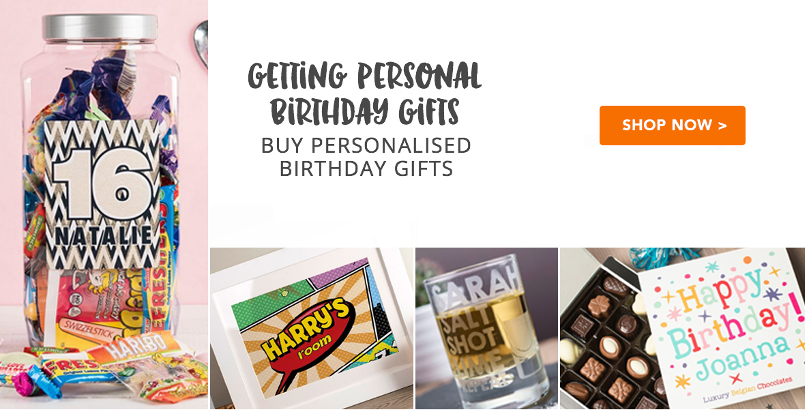

# Getting Personal - PPC Landing Page :rocket:

### background :pill:
of the top conversion paths PPC accounts for 60% of all conversions. Over last 3 months, PPC conversion generated over 200k
and is one of the highest converting channels.

### hypothesis . :floppy_disk:
ensuring landing page content is relevant to the advert copy and simplified to take users to where they need to go will increase search relevance and therefore conversions

### targeting . :jack_o_lantern:
- www.gettingpersonal.co.uk     
- www.gettingpersonal.co.uk/cards     
- www.gettingpersonal.co.uk/birthday-presents/birthday-gifts.htm       
- www.gettingpersonal.co.uk/anniversary-presents/anniversary-gifts.htm      
- www.gettingpersonal.co.uk/gifts-for-him/personalised-gifts-for-him.htm      
- www.gettingpersonal.co.uk/gifts-for-her/personalised-gifts-for-her.htm      
- www.gettingpersonal.co.uk/personalised-presents/personalised-gifts.htm      

### devices
desktop   :collision:

### integrations   :star:
- GA Universal
- Hotjar

### changes    :notes:
- removed all content on page included following
-   navigation links
-   side menu navigation
- new hero/cta image and link  (6 pages, 6 images, 6 links)

### hero links     :round_pushpin:
- cdn.optimizely.com/img/153957092/f78b157d173749bb845935c399be190f.png :arrow_heading_up:
- cdn.optimizely.com/img/153957092/3138e33a11fa41cb8337440f3abcd788.png :arrow_heading_up:

<kfd>gettingPersonal</kfd>

### to do: :coffee: :page_facing_up:
- check on IE10
- remove comments
- build other five hero images on photoshop

### cards page images:  (need larger images)
- are 320x320 (too small)
- canvas is 1186px x 604px
- tall image is 305x600    (needs to be taller - is 320 - twice as much taller)
- left image is 300 x 238 (ok)
- center image is 209 x 237 (ok)
- right image (360 x 237)  Needs to be a bit wider  360 instead of 320

:100:
